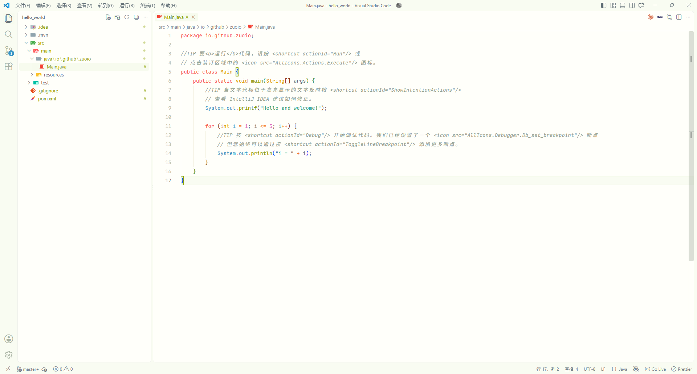
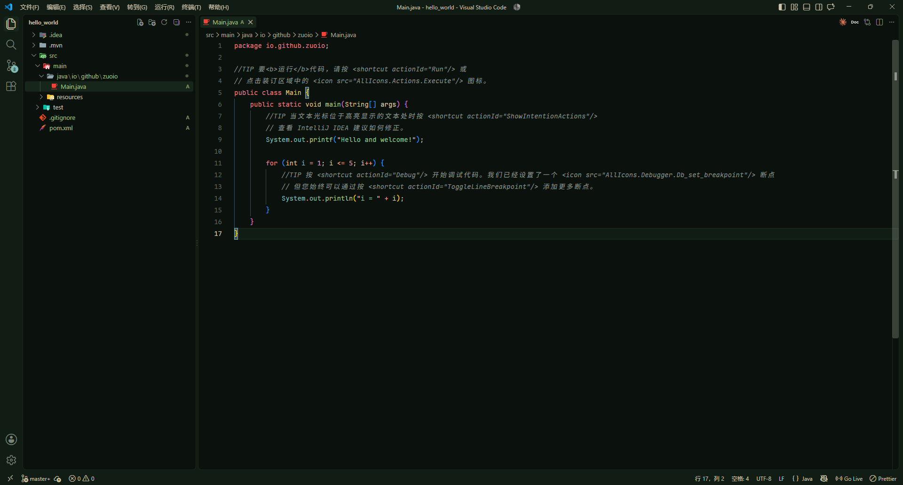

# Spring Forest VSCode

Spring Forest VSCode is a pair of calm, nature-inspired Visual Studio Code color themes based on the palettes from the Spring Forest JetBrains theme plugin.

## Preview

| Spring Forest | Night Forest |
| --- | --- |
|  |  |

## Themes

### Spring Forest

A light theme with a warm, soft-green interface and clear blue, green, orange, and purple syntax accents.

### Night Forest

A dark theme with deep green backgrounds, low-contrast panels, and gentle Everforest-inspired syntax colors.

## Palette

| | Spring Forest | Night Forest |
| --- | --- | --- |
| Editor background | #FFFFFA | #0B120E |
| UI background | #F9FCF2 | #111C15 |
| Editor foreground | #5C6A72 | #D3C6AA |
| Primary accent | #3A94C5 | #7FBBB3 |
| Green accent | #8DA101 | #A7C080 |

The theme definitions include VS Code workbench colors, editor states, terminal ANSI colors, Git and diff decorations, TextMate scopes, and semantic token colors.

## Use the themes locally

1. Open this directory in Visual Studio Code.
2. Press F5 to launch an Extension Development Host window.
3. Run **Preferences: Color Theme** and choose **Spring Forest** or **Night Forest**.
4. After editing a theme file, run **Developer: Reload Window** in the development host.

The theme files are:

~~~text
themes/spring_forest_color_theme.json
themes/night_forest_color_theme.json
~~~

## Package the extension

Install the **vsce** tool once, then run it from this directory:

~~~powershell
npm install --global @vscode/vsce
vsce package
~~~

This produces a VSIX file that can be installed from the Extensions view using **Install from VSIX...**.

The publisher value in package.json is currently spring-forest; replace it with your Marketplace publisher ID before publishing.

## Project layout

~~~text
spring-forest-vscode/
├─ example/
│  ├─ spring-forest.png
│  └─ night-forest.png
├─ themes/
│  ├─ spring_forest_color_theme.json
│  └─ night_forest_color_theme.json
├─ package.json
└─ README.md
~~~

## License

MIT. See [LICENSE](./LICENSE).
